# Overview
So looking for info on the VST 2. It looks like it's non-longer maintained by the original creator, and they are pushing VST 3. VST 2 SDK also seems to have some odd/restrictive licensing from a quick search about it. Also sounds like the creator is no longer licensing the SDK. Just going to avoid this all together. So I am gonna try to figure out the structure for VST 2 and write a C and Rust interface for them. While I am aware there probably some open source projects I could check like LMMS. However, I also want to put my reverse engineering skills to work. So gonna do this completely blind. At least when I think I am done or completely stymied I can see what I missed by looking at such projects.

# Findings and Process
The below will be me documenting what I have figured out in the order I discover things and how.

## Functions
The first order bushiness is to see what functions DLLs export. All DLLS I have tried seem to export 2 functions *main*, and *VSTPluginMain*. The fact it so few may mean these functions probably have pretty complicated parameters considering how varied VSTs are. I have also noticed *main* and *VSTPluginMain* most the time seem to have the same offset. This means they should have the same function signature. When I see something like this it is generally done for compatibility reasons because a name change. Luckily this make choosing a starting point easy there is only one starting point.

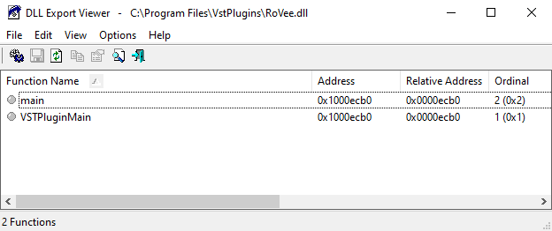

## Function Signatures
So let's try figure out the signature of our DLLs only exported function. I am going to use snow many here to hopefully speed this up. So looking at the assembly and de-compiled code of 64 bit and 32 bit dlls the return values differ in width. On windows a plain int is 32 bits. So it's not returning an int on 64 bit. It's either a large number or a pointer. I am going to probably guess returning a pointer, as there are only a few types that expand between 32 bit and 64 bit mainly pointers, or size_t.

Snowman definitely seems to not be noticing things correctly. The 64 bit dlls so far I have looked at only take a single pointer as an argument. However 32 bit are showing differnt numbers of arguments when looking at de-compiled code from snowman. Different argument numbers would not make sense for a dll entry point. So I need to look more closely at the assembly, and the call stack.

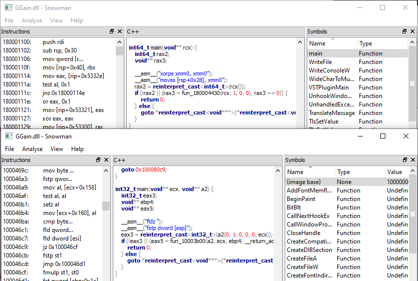

Thankfully, when I look more closely it should be only one argument. I have also noticed another thing with snowman it does not account for the registers as part the windows 64 bit calling convention in all cases. For instance looking at the assembly in the image below it's pretty obvious. Also because this DLL calls the pointer passed in it's obviously a call back.

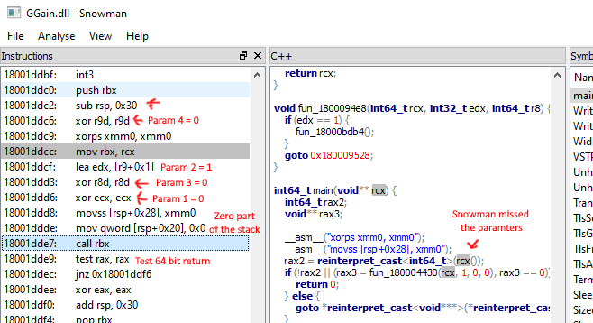

So I can conclude that VST entry point function takes one argument, which is a call back that takes 6 six arguments. You can see the code in the 32 bit dll calls it with 6 args. Also when double checking in the 64 bit it also is using 6 args. As to what this call back does I am currently wondering if something like wglGetProcAddress() from the openGL world. The function wglGetProcAddress() makes it easy to get new call backs, and I have seen variations of for plugins so they can get newer functionality from host applications, but still be backward compatible. Not unusual design choice for systems that can add new function calls. However just a tentative guess at this moment, and could be completely different.

Well after a little more static analysis, it looks like the entry point returns a pointer, to what I think is a struct or array of some kind. However, still have not really been able to determine what the fields are to this struct. Probably going to need to load plugins and see how the application and plugin interact.

So I am gonna use LMMS to launch the VST plugins, it spawns a separate process for each VST. (RemoteVstPlugin.exe and RemoteVstPlugin32.exe) So I need to attach my debugger to this process as soon as it starts. Luckily, I can create debug entry in *HKEY_LOCAL_MACHINE\SOFTWARE\Microsoft\Windows NT\CurrentVersion\Image File Execution Options* to make this easy on windows, but...

Well doing that seems to lockup LMMS, and the *RemoteVstPlugin* executable will terminate itself after letting it run. So I have written a very simple program that blindly polls the processes and suspends one the VST Plugin processes. (See suspender.c in the tools folder) This gives me plenty of time to attach debugger and then resume the process, and it seems to work well enough yay! (やった!) This will be much more effective now that I can examine the DLLs under use.

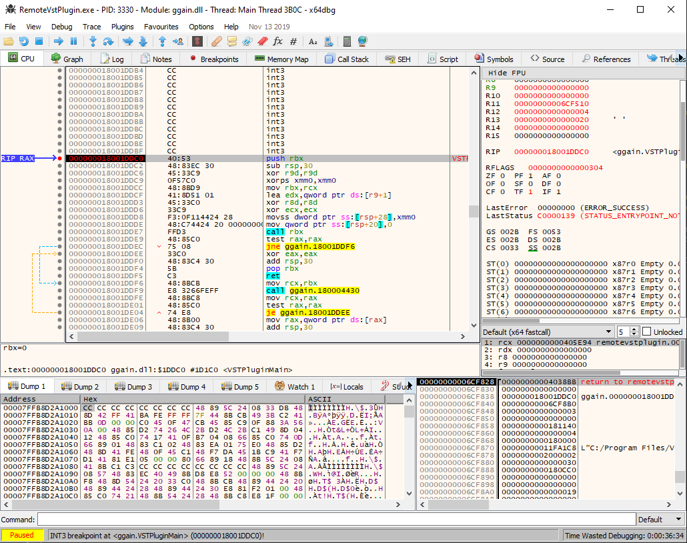

## Return Type Struct Pointer or String Pointer?

So the returned pointer is in the data segment of this dll. Moreover, I thought it was a struct when looking around with snowman. However, it looks to be just the string "PtsV". The value seems be the same in other dlls. Maybe *VSTPluginMain* does not return anything that interesting, unless there is data after "PtsV" used by the calling process. If it's just a string I am I probably done here.

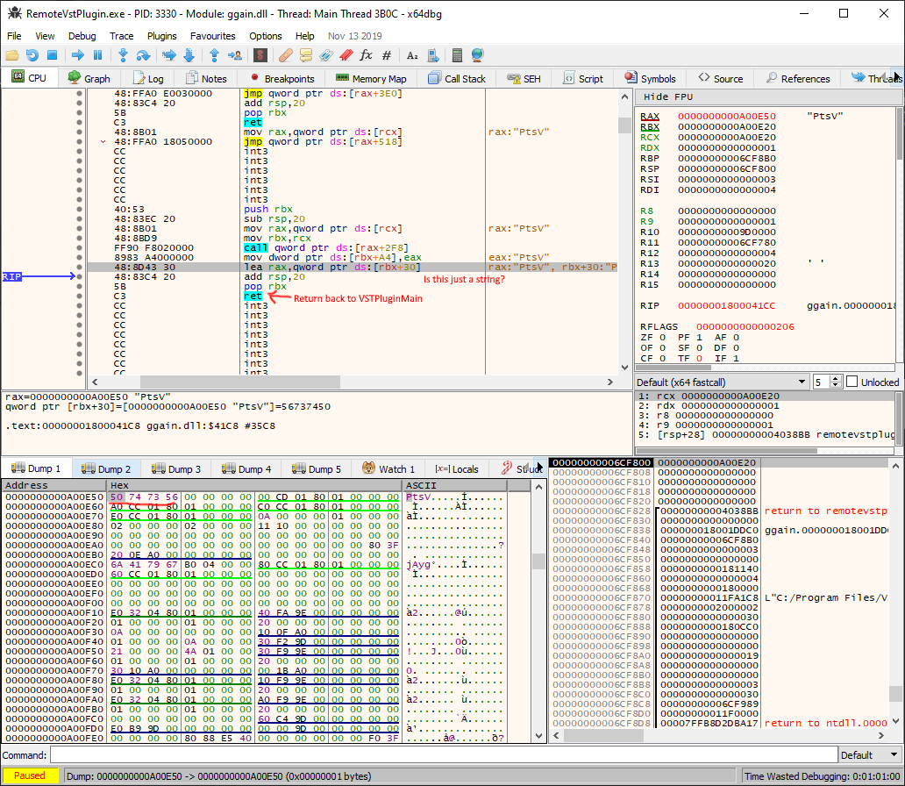

So the host process does multiple things with the returned pointer. It checks that DLL does not return *NULL*. Then it checks to see if the pointer points to a value equal to "PtsV". If it does not equal "PtsV" it does not consider the DLL a VST plugin. This value seems to be used so one can identify a VST plugin. However, the pointer is accessed with additional offsets when looking at the assembly code ahead. So clearly it's some kinda of structure that begins with a string?


## A 32 bit number

So the structure returned by the plugin has what I assume is a 32 bit number, but the host application is trying to print each byte like it's a string. It's position is at *0x48* for 32 bit and *0x70* for 64 bit. This number's value also changes among different plugins, even of similar type. It's purpose is unclear at the moment. Lets just call it `val32_one` for now.

### Result on 64 bit
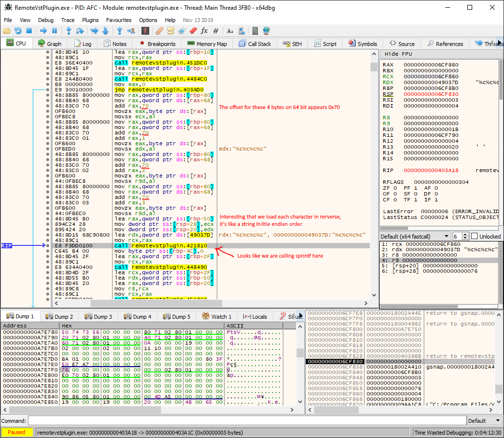

### Result on 32 bit
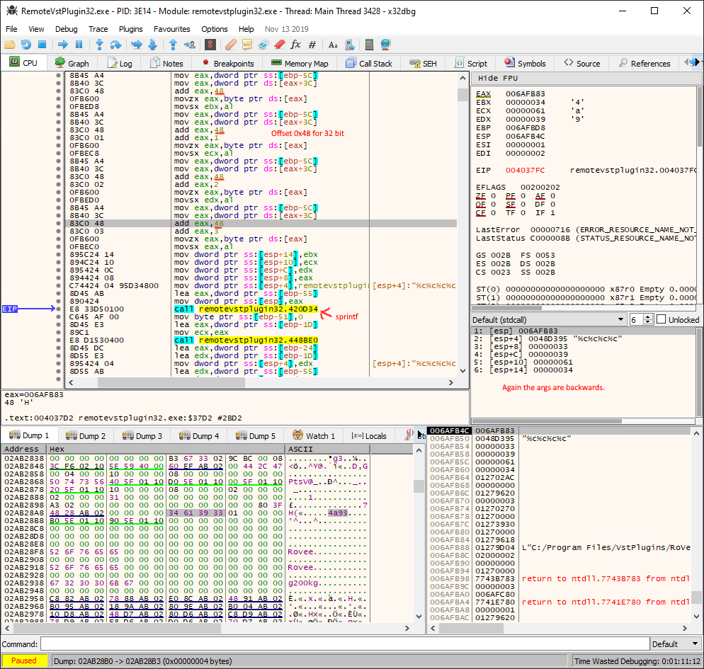

## A little math (You May Skip reading this)

This is a technique I like to use when comparing structs on machines/code of different bit widths. Padding can make knowing when a value expands to fit the underline machine word more difficult because padding makes other values to appear as they have expanded as well. So if you are able to determine the length of a struct or length of a section. You can use it help zero in on how many elements expand. However, I have noticed that it's less effective for longer structs.

So we know the position of `val32_one` for both 32 and 64 bit plugins. Now I take `0x70` minus `0x48` I get 40 bytes. This gives me some other useful information. This number is divisible by 4 which makes me think it's the result of some struct members going from 4 to 8 bytes wide. The difference is the same between any 64 bit or 32 bit plugin I have tried. The 40 bytes in size is enough for 10 values assuming perfect packing. This behavior makes me think the struct has a fair amount of pointers preceding `val32_one`. Since 0x48 = 72 bytes that's enough room for 18 four byte values in a 32 bit plugin.

Assuming no 16 bit or single byte values we can get an equation to estimate how many numbers expanded. This is a reasonable assumption because the smaller values would either keep the same padding or pad the same way as a 4 byte value. Lets start with the equation `8 * X + 4 * Y + 4 * Z = 112`. Where X is the number values that expand from 4 to 8 bytes. Y is the number of times padding is needed. Z is the number 4 byte entries. We know X can't exceed 10, and Y can only be less than or equal to X. The total length must equal 112. However we can get a simpler set of equations that both depend on X. Plugins that are 32 have no padding so we can use the following: `4 * X + 0 * Y + 4 * Z = 72`. This gives us two new equations `Y = 10 - X`, and `Z = 18 - X`. Also because the constraint on Y we know X must be greater than 4. This means there is only 5 to 10 values which expanded. These 5 to 10 values are probably pointers. Sadly, less narrow than I would have liked, but if we get enough Z values, or find more instances of padding we can limit the range further.

## Function Pointers

So looking at more closely at the values in the struct there is definitely 4 function pointers after the value "PtsV". These values point to the text segment of the loaded DLL. Also looking where those location point to they have a very apparent function prologue and epilogue when disassembled. Moreover, the math I did above says there must at least 1 more pointer or value that expands to 8 bytes. However, these 4 pointers are positioned in such a manner that it only adds one to the Y value. This means at most there can only be 9 values that expand to 8 bytes.

I also found a couple function pointers shortly after the `val32_one` I identified earlier. Not 100% sure if they are part the struct yet though as I still have yet to determine how many bytes long or the struct's ends.

### Struct Pointers
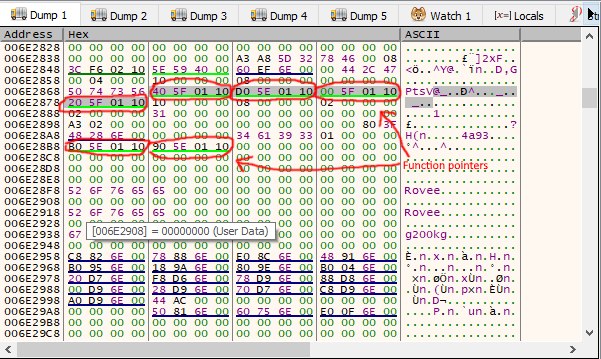

### Where the pointer right after "PtsV" points
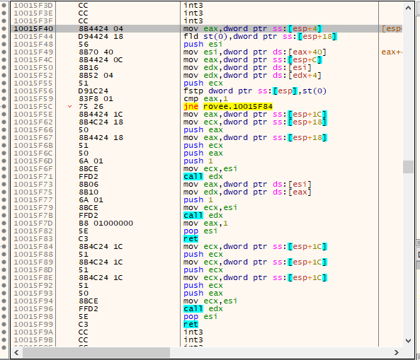

## More Numbers

So it looks likes we have 5 32 bit values following those 4 function pointers. The values seem to be always set, and they are the same width in 32 bit and 64 bit dlls. So it seems to be a pretty safe guess. What is more challenging is the bytes following these are zero in the DLLS I am testing, and the size changes. All zeros makes it hard to find starts and stops.

### More 32 bit values
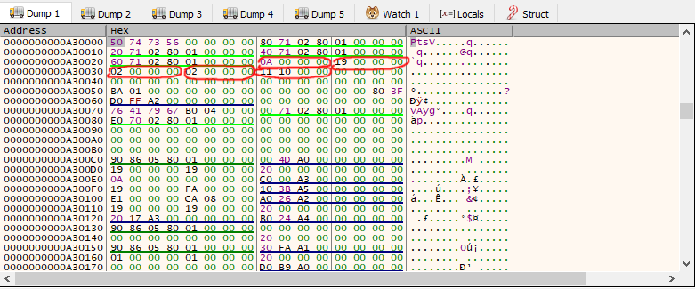

## New Pointers and Possible struct

So I have noticed that 2 values preceding `val32_one` are probably pointers. The first one which I circled in orange this time seems to point always a little before this struct. It might be an other struct. However, it seems to vary how far it points ahead even among same bit dlls. The value following this pointer also seems to expand from 4 to 8 bytes when comparing 32 bit and 64 bit dlls. Additionally, it seems to always be zeroed. Lastly, the value circled in purple from all the plugins I have tried is set to `0x00 0x00 0x80 0x3f` in the dlls I have examined so far. This value equals one as a float, but it might not be a float. Hopefully, I can find a DLL that uses a different value here. That would let me know for certain if it's a float or an integer.

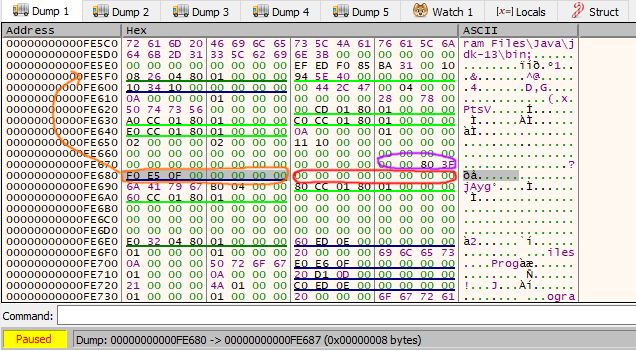

## Struct Size/Length

Fortunately, it seems that the struct is bzero-ed or memset-ed to zero in a fair amount of plugins I have looked at. The size for zeroing always seems to be a 192 bytes for 64 bit plugins, and 144 bytes for 32 bit plugins. Interestingly, the difference here is only 48 bytes between the two. We know that the leading part changed by 40 bytes, so that means the lower part expands only by 8 bytes. Moreover, I have already identified two function pointers after the value that LMMS was sprintf-ing (`val32_one`). So it would seem there are no other members in the struct in the lower half that change size between 64 bit and 32 bit DLLs.

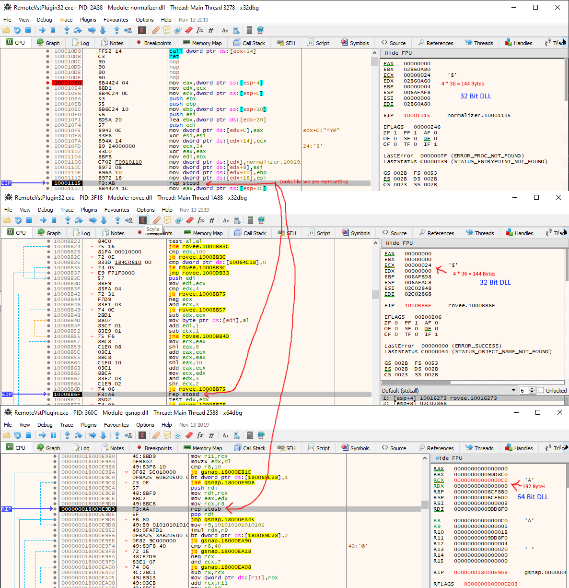

## Struct Initialization

However, despite what we can infer from size changes the initialization gives the most information about the struct's layout. It can help us know more than how many 4 vs 8 byte elements are in the struct but order which I have figured out a fair amount so far, but this helps pin down a lot. Also it seems like the majority of the pointers are functions from this and what I have found above.


So the pointer in the 64 bit dll starts ahead our struct, but no worries out struct starts at offset 0x30. So let's take the offset and width in assembly and sort by the offsets in a table. This table can help us find padding, and infer any missing values in any gaps. Combined with the fact the offsets follow a nice 4 byte spacing in 32 bit dlls this makes my job easier.

| Offset | Width |  Type  | Comment   |
| ------ | ----- | ------ | --------- |
| 0x30   | 4     | CONST  | "PtsV"    |
| 0x38   | 8     | func*  ||
| 0x40   | 8     | func*  ||
| 0x48   | 8     | func*  ||
| 0x50   | 8     | func*  ||
| 0x58   | 4     | int    ||
| 0x5C   | 4     | int    ||
| 0x60   | 4     | int    ||
| 0x64   | 4     | int    ||
| 0x8C   | 4     | float  ||
| 0x90   | 8     | struct*||
| 0xA0   | 4     | int    | `val32_one` |
| 0xA4   | 4     | int    |
| 0xA8   | 8     | func*  |
| 0xB0   | 8     | func*  |

### Accounting for gaps

Firstly, it's obvious there is padding between *0x30-0x38*. Offsets *0x8C-0x90* might appear to have padding between them at first glance. However, we can see that from the 32 bit assembly also skip 4 bytes. This is indicative of an other 4 byte field in the struct. We have an 8 byte gap between the struct* and `val32_one`. When looking at the 32 bit offsets in the assembly above it's only 4 bytes. So it's probably a pointer left NULL on initialization.

The most annoying gap would be between *0x64-0x8C*. This gap is 36 bytes large on 64 bit DLLs, and only 24 bytes on 32 bit DLLs. This is a 12 byte difference which can mean only two things. First there are 3 values that expand with no padding/slop or second, two values that expand with one group of padding bytes. Even the equations derived above are not a help as Y = 1, and Y = 2 are both allowed with the information I have thus far. However, it looks 0x68 is set outside the initialization procedure I found, and is checked by LMMS when loading something it calls an editor from the near by strings. It's a dword so a 4 byte value. Also remember from my analysis above found five follows after the first four function pointers. However, the next space after it would be at 0x6c and this is not 8 byte aligned so it must either be padding or an other 4 byte value.
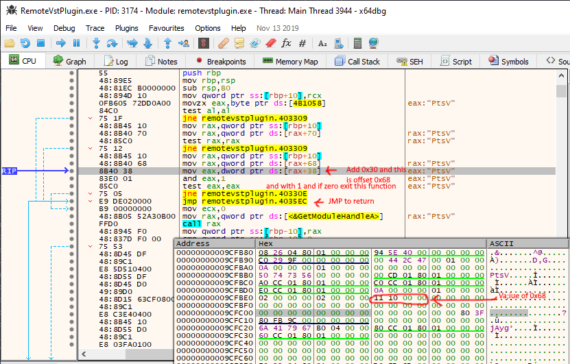

### Finally!

So while trying to figure out the layout & sizes in that gap, I finally found a plugin (*DynamicAudioNormalizer*) that sets an other value in that range. I guess that is the advantage with a widely used interface a lot more corner cases will be used. The value at 0x80 appears to be a 4 byte value (0x000A6e1e), and is used in 32 and 64 bit plugins. What is more important though is the area I circled in blue stays the same between both 64 bit and 32 bit. First, this tells me there are only 2 values that probably are pointers in this gap. Secondly, It tells me that there are two more 4-byte values before the float. It also means that area circled in pink for a 64 bit plugins is padding, and not a value.

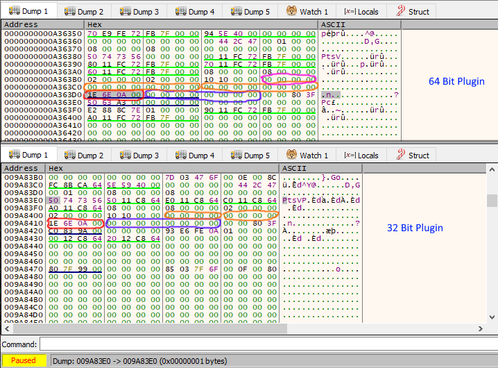

### The Remaining Bytes

So when you have a 64 bit plugin the struct is 192 bytes long. I have been able to figure out layout of a 136 bytes. This leaves 56 bytes that I can't seem to find used by anything. When it comes to 32 bit plugins they are 144 bytes long, I have figured out 88 bytes. This also leaves 56 bytes. So it seems to be a safe bet these trailing bytes do not change in size.

## The Final Struct layout

Thus we have the finally enough information to make a preliminary struct layout. This probably is the layout unless shorts or bytes are used in which case there may be more padding. However, so far I have only seen dword and qword loads and stores. The only exception so far is `val32_one` when LMMS is sprintf-ing it. Next I need to identify what each field does, and arguments and expected behavior of all function pointers we have discovered thus far.

```C
#include <stdint.h>

// Our preliminary Struct layout

struct vst_return_struct {
    uint8_t check_bytes[4];
    void* func0;
    void* func1;
    void* func2;
    void* func3;
    uint32_t val_0;
    uint32_t val_1;
    uint32_t val_2;
    uint32_t val_3;
    uint32_t val_5;
    void* something_0; // Could also be size_t or uintptr_t
    void* something_1; // Could also be size_t or uintptr_t
    uint32_t val_6;
    uint32_t val_7;
    uint32_t val_8;
    float float_0;
    void* struct_0;
    void* something_2; // Could also be size_t or uintptr_t
    uint32_t val_9;
    uint32_t val_A;
    void* func4;
    void* func5;
    uint8_t unknown[56];
};
```