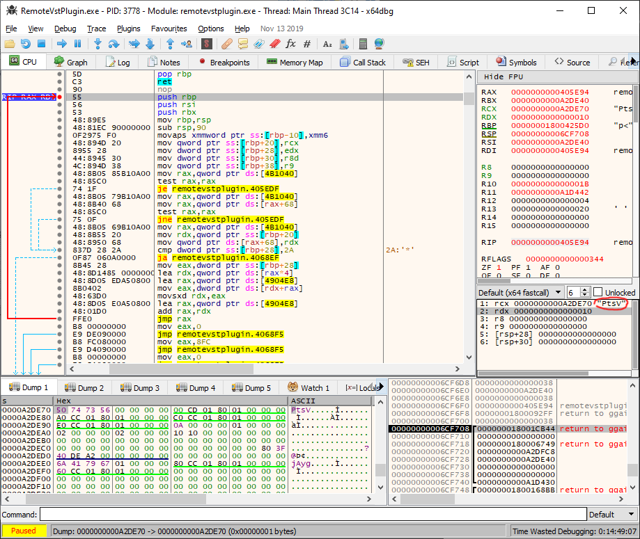
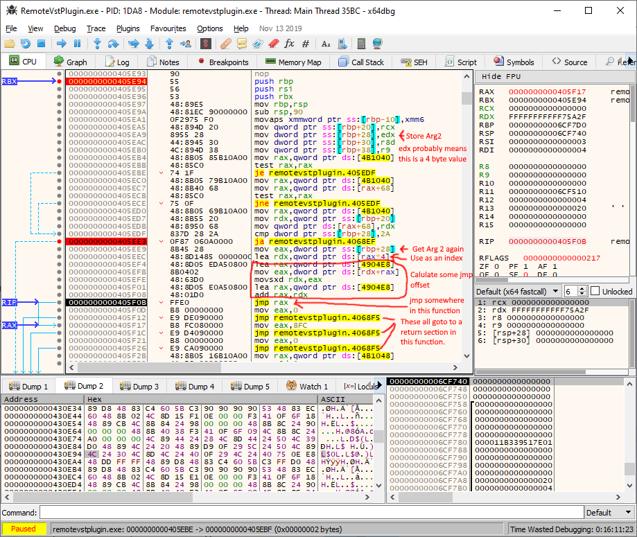
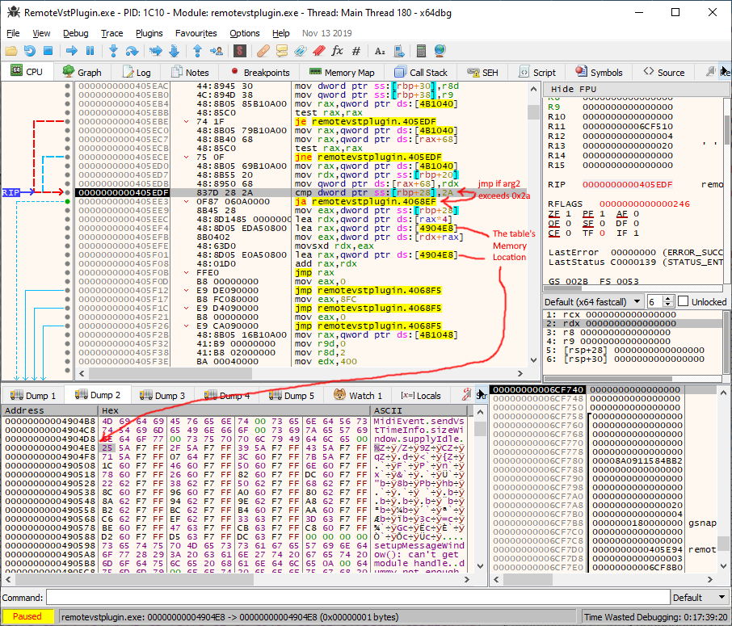
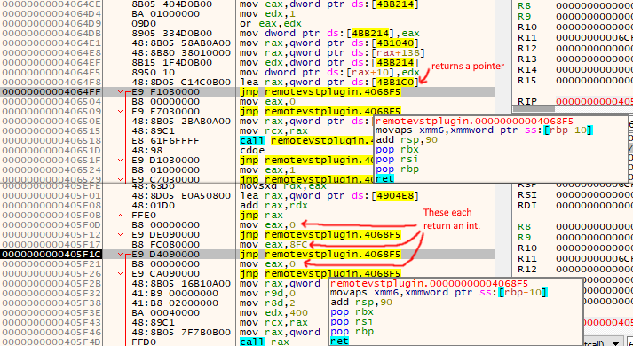

# Sections
[Getting Started (Part 1)](./reversing-1.md)

[Reversing Functions (Part 2) - *here*](./reversing-2.md)

# Functions

So we have identified in the first section 7 functions. The callback provided to *VSTPluginMain*, and the 6 functions in the struct. The struct has 3 values that could be pointers as well that uses eludes me at the moment. So the simplest order of bushiness is to set break points on each function and see how the args change with each call, and observe the behavior.

# Function Number One

So I shall start with the sole argument to *VSTPluginMain* we already know that it has 6 arguments. So lets try to finish what we started. So the first time the function is called the args are 0, 1, 0, 0, 0, and 0.

## Parameter One

Well that was an easy one. So far other than first call which is zero or NULL it has always been a pointer to our struct we spent time dissecting earlier.



## Parameter Two

Well this function has suddenly become quite complicated. When looking at what LMMS does with this value we can see that it's being used to drive a jump table. Also looking where the function returns it's quite large. So this function is behaving more like many functions. Moreover, from a quick look this seems to determine even if the other arguments/parameters are used or not.



Well it looks like LMMS just returns if the value exceeds 42, so there 43 values that LMMS handles. Weather or not that is all of them I do not know. However, this interface is less clean that I would have liked. However, I think I am gonna figure out the return type, probably the other functions before I am come back to this. I also may want an other application capable of running VSTs to help elucidate this



## Return type

At least this is quite simple compared to what I encountered above. A quick look at register *rax* before return shows this function both returns pointers and integers. So in C a suitable return type would `void*`, `intptr_t`, or `uintptr_t`.

I am going to look at the other functions before trying to decipher arg2, and how the return type and other parameters change. I am just gonna call it function select. So for now our function prototype would be this.

```C
intptr_t app_callback(struct vst_return_struct* struct_ptr, unsigned func_select, unknown, unknown, unknown, unknown);
```


