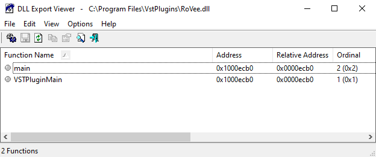
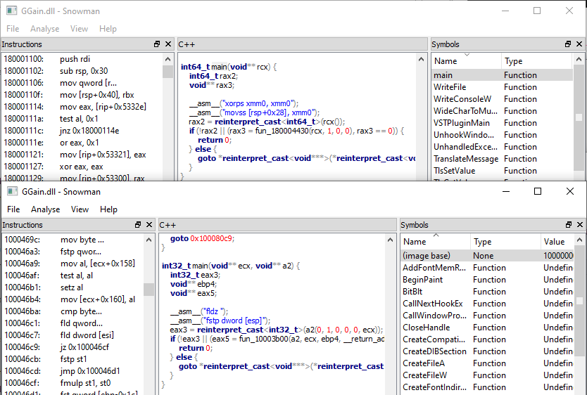

# Overview
So looking for info on the VST 2. It looks like it's non-longer maintained by the orginal creator, and they are pushing VST 3, both which seems to have nasty licensing. Just going to avoid this all together. So I am gonna try to figure out the struture for VST 2 and write a C and Rust interface for them.

# Functions
DLLS Seem to export 2 functions main, and VSTPluginMain. The fact it so few means these functions probably have pretty complicated parameters. Also the fact main and VSTPluginMain most the time seem to have the same offset means they should have the same function signature.

# Function Signatures
So looking at the assembly of 64 bit vs 32 bit dlls the return values differ. On windows a plain int is 32 bits. So it's not returning an int on 64 bit. It's either a large number or a pointer. I am going to probably guess returning a pointer, as it would make no sense to change the width between 32bit and 64bit. The 64 bit dlls so far I have looked at only take a single pointer as an agrument, but 32 bit dlls are not remaining constant. At least when looking at decompiled code from snowman. Different agrument numbers would not make sense for a dll entry point. So I need to look more closely at the assembly, and the call stack.

