# Overview
So looking for info on the VST 2. It looks like it's non-longer maintained by the original creator, and they are pushing VST 3. VST 2 SDK also seems to have some odd/restrictive licensing from a quick search about it. Also sounds like the creator is no longer licensing the SDK. Just going to avoid this all together. So I am gonna try to figure out the structure for VST 2 and write a C and Rust interface for them. While I am aware there probably some open source projects I could check like LMMS. However, I also want to put my reverse engineering skills to work. So gonna do this completely blind. At least when I think I am done or completely stymied I can see what I missed by looking at such projects.

# Findings and Process
The below will be me documenting what I have figured out, and how.

## Functions
DLLS Seem to export 2 functions *main*, and *VSTPluginMain*. The fact it so few means these functions probably have pretty complicated parameters. Also the fact *main* and *VSTPluginMain* most the time seem to have the same offset means they should have the same function signature.


## Function Signatures
So looking at the assembly of 64 bit vs. 32 bit dlls the return values differ. On windows a plain int is 32 bits. So it's not returning an int on 64 bit. It's either a large number or a pointer. I am going to probably guess returning a pointer, as it would make no sense to change the width between 32bit and 64bit. The 64 bit dlls so far I have looked at only take a single pointer as an argument, but 32 bit dlls are not remaining constant. At least when looking at de-compiled code from snowman. Different argument numbers would not make sense for a dll entry point. So I need to look more closely at the assembly, and the call stack.


So far from looking more closely it seems like it should be only one argument. Also noticed an other thing with snowman it does not account for the registers as part the windows 64 bit calling convention in all cases. For instance looking at the assembly here it's pretty obvious.

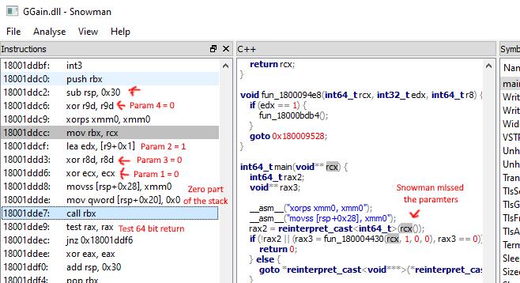

However, the VST 2 entry point seems to take one argument, which is a call back that takes 6 six arguments. I am currently wondering if it's something like wglGetProcAddress() which is a function that lets you get other functions. Not unusual design choice for systems that can add new function calls. However just a tentative guess at this moment.

Well after a little more static analysis, it looks like the entry point returns a pointer, to what I think is a struct or array of some kind. However, still have not really been able to determine the arguments, or what the fields are to this struct. Probably going to need to load the plugins and see how the application and program interact.

So I am gonna use LMMS to launch the VST plugins, it spawns a separate process for each VST. (RemoteVstPlugin.exe and RemoteVstPlugin32.exe) So I need to attach my debugger to this process as soon as it starts. Luckily, I can create an entry in *HKEY_LOCAL_MACHINE\SOFTWARE\Microsoft\Windows NT\CurrentVersion\Image File Execution Options* to make this easy on windows, but...

Well doing that seems to lockup LMMS, and the *RemoteVstPlugin* executable will terminate itself after letting it run. So I have written a very simple program that blindly polls the processes and suspends one the VST Plugin processes. (See suspender.c in the tools folder) This gives me plenty of time to attach debugger and then resume the process, and it seems to work well enough yay! (やった!) This will be much more effective now that I can examine the DLLs under use.

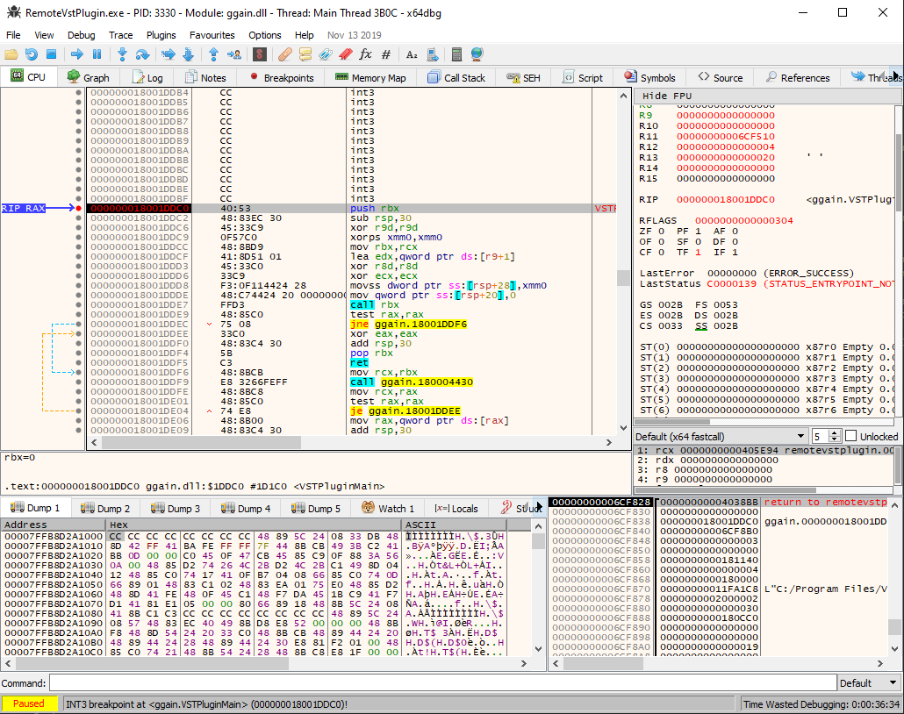

## Return Type Struct Pointer or String Pointer?

So the returned pointer is in the data segment of this dll. Moreover, I thought it was a struct when looking around with snowman although it looks to be just the string "PtsV". The value seems be the same in other dlls. Maybe *VSTPluginMain* does not return anything that interesting, unless the data following "PtsV" afterwards is used by the calling process. If it's just a string I am I probably done here.

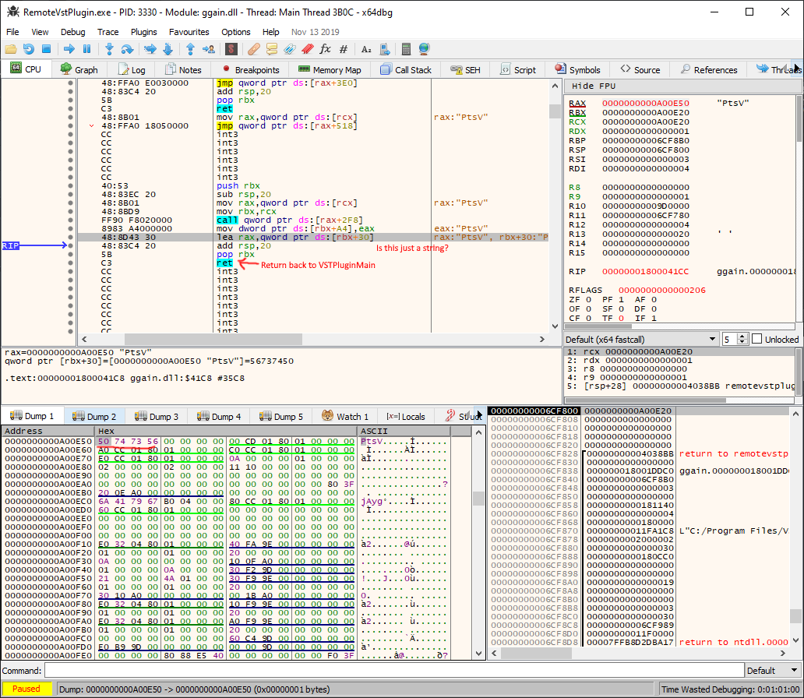

So the host process does multiple things with the returned pointer. It checks that DLL does not return *NULL*. Then it checks to see if the pointer points to a value equal to "PtsV". If it does not equal "PtsV" it does not consider the DLL a VST plugin. This value seems to be used so one can identify a VST plugin. However, the pointer is accessed with additional  different offset when looking at assembly code ahead. So clearly it's some kinda of structure that begins with a string.

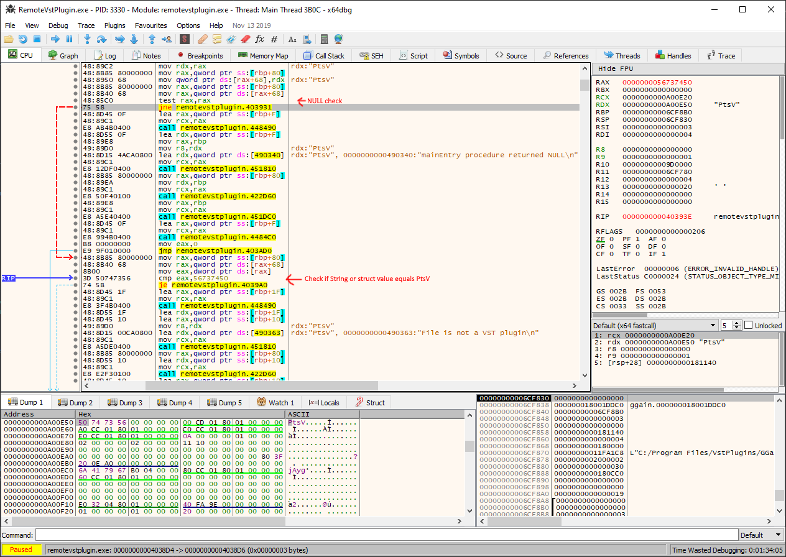

## A 32 bit number

So the structure returned by the plugin has what I assume is a 32 bit number, but the host application is trying to print each byte like it's a string. It's position is at *0x48* for 32 bit and *0x70* for 64 bit. This number also seems to change among plugins, even of similar type. It's purpose is unclear at the moment. Lets just call it `val32_one` for now.

### Result on 64 bit
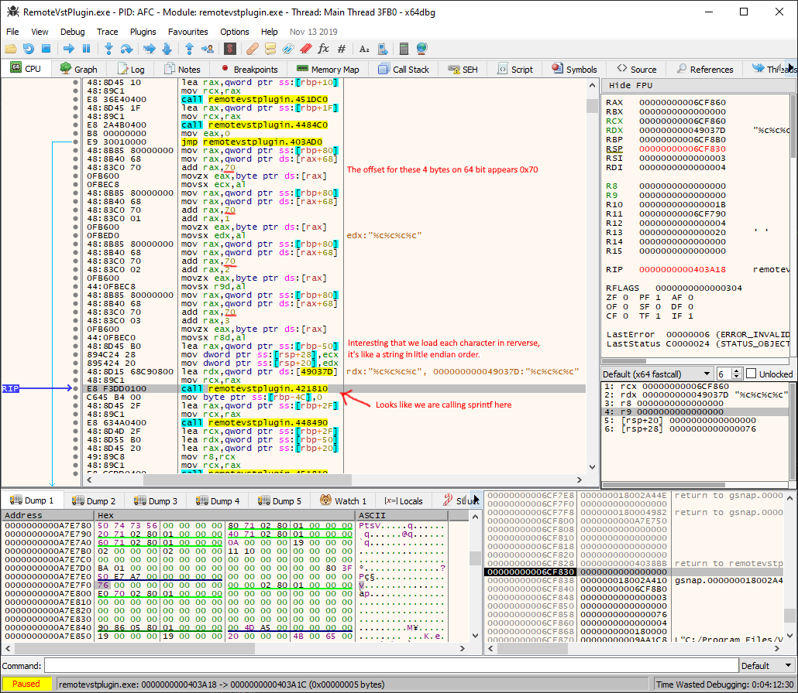

### Result on 32 bit


## A little math

However, If I take `0x70-0x48` I get 40 bytes. This gives me some other useful information. This number is divisible by 4 which makes me think it's the result of some struct members going from 4 to 8 bytes wide. It is enough for 10 values assuming perfect packing. This behavior makes me think the struct has a fair amount of pointers above this 32 bit number. Since 0x48 = 72 bytes that's enough room for 18 four byte values. The difference between 32 bit and 64 bit dlls is enough for only 10 expansions, and this means there must be padding slop. If an 8 byte value comes after a 4 byte value we will get an additional 4 bytes of slop. Also the first 4 bytes are an identifier for a VST plugin ("PtsV").

Assuming no 16 bit or single byte values we can get an equation to estimate how many numbers I would expect to go from 4 to 8 bytes. We can get equation like this from that info `8 * X + 4 * Y + 4 * Z = 112`. Where X is the number values that expand from 4 to 8 bytes. Y is the number of times padding is needed. Z is the number 4 byte entries. We know X can't exceed 10, and Y can only be less than or equal to X. And the total value must equal 112. However we can eliminate a variable since for 32 bit we know `4 * X + 0 * Y + 4 * Z = 72`. This gives us two new equations `Y = 10 - X`, and `Z = 18 - X`. Also because the constraint on Y we know X must be greater than 4. This means there is only 5 to 10 values which expanded. These 5 to 10 values are probably pointers.

## Function Pointers

So looking at more closely at the values in the struct there is definitely 4 function pointers after the value "PtsV". These values point to the text segment of the loaded DLL. Also when jumping to the locations to memory they have a very apparent function prologue and epilogue when disassembled. Moreover, the math I did above says there must at least 1 more pointer or value that expands to 8 bytes. However, these 4 pointers are positioned in such a manner that it only adds one to the Y value. This means at most there can only be 9 values that expand to 8 bytes.

I also found a couple function pointers shortly after the `val32_one` I identified earlier. Not 100% sure if they are part the struct yet though as I still have yet to determine how many bytes long or the struct's ends.

### Struct Pointers
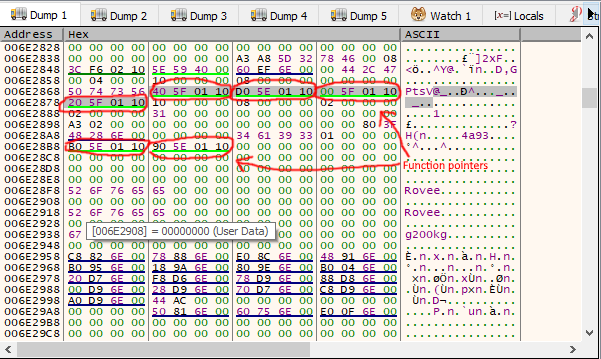

### Where the pointer right after "PtsV" points
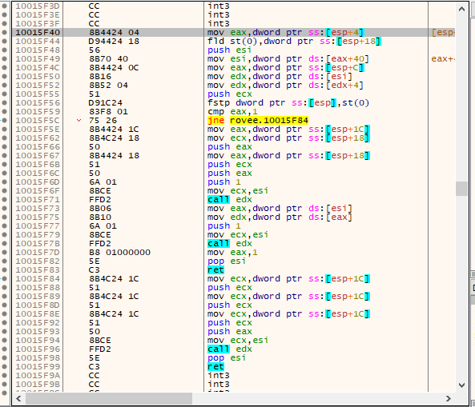

## More Numbers

So it looks likes we have 5 32 bit values following those 4 function pointers. They also appear to be set in 32 bit dlls. So it seems to be a pretty safe guess. What is more challenging is the bytes following these are zero in the DLLS I am testing.

### More 32 bit values
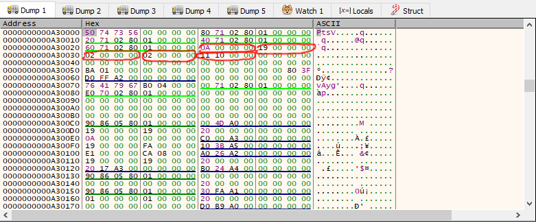

## New Pointers and Possible struct

So I have noticed that 2 values preceding `val32_one` are probably pointers. The first one which I circled in orange this time seems to point always a little before this struct. It might be an other struct. However, it seems to vary how far it points ahead even among same bit dlls. The value following this pointer also seems to expand from 4 to 8 bytes when comparing 32 bit and 64 bit dlls. Additionally, it seems to always be zeroed. Lastly, the value circled in purple seems to be `0x00 0x00 0x80 0x3f` in the dlls I have examined so far. This value equals one as a float, but it might not be a float. Hopefully, I can find a DLL that uses a different value here. That would let me know for certain if it's a float or an integer.

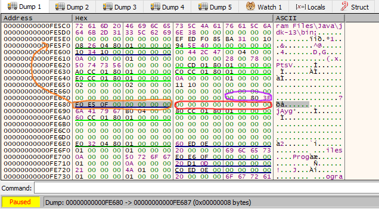

## Struct Size/Length

Fortunately, it seems that the struct is bzero-ed or memset-ed to zero in a fair amount of plugins I have looked at. The size for zeroing always seems to be a 192 bytes for 64 bit plugins, and 144 bytes for 32 bit plugins. Interestingly, the difference here is only 48 bytes between the two. We know that the leading part changed by 40 bytes, so that means the lower part expands only by 8 bytes. Moreover, I have already identified two function pointers after the value that LMMS was sprintf-ing (`val32_one`). So it would seem there are no other members in the struct in the lower half that change in size between 64 bit and 32 bit DLLs.

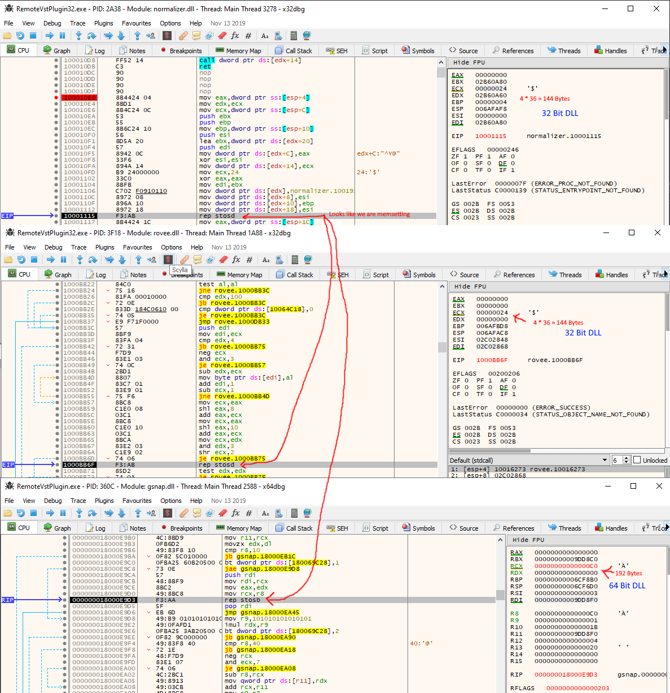

## Struct Initialization

However, despite what we can infer from size changes the initialization gives the most information about the struct's layout. It can help us not just how many 4 vs 8 byte elements are in the struct but order which we have figured out a fair amount so far, but this helps pin down a lot. Also it seems like the majority of the pointers are functions.

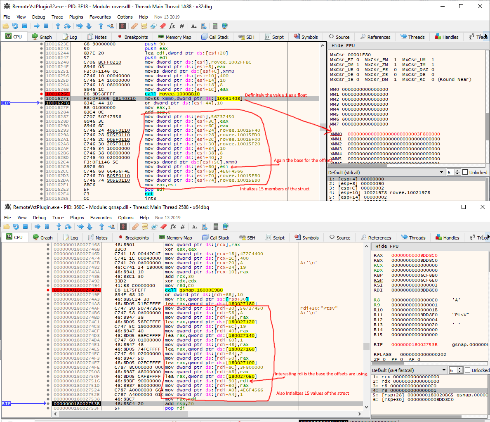

So pointer in the 64 bit dll starts ahead our struct so "PtsV" starts at offset 0x30. So lets take offset and width in assembly and order them by the offsets in a table with this table can use it to help find padding, and infer any missing values. Combined with the how the offsets follow a nice 4 byte spacing in 32 bit dlls this makes my job easier.

| Offset | Width |  Type  | Comment   |
| ------ | ----- | ------ | --------- |
| 0x30   | 4     | CONST  | "PtsV"    |
| 0x38   | 8     | func*  ||
| 0x40   | 8     | func*  ||
| 0x48   | 8     | func*  ||
| 0x50   | 8     | func*  ||
| 0x58   | 4     | int    ||
| 0x5C   | 4     | int    ||
| 0x60   | 4     | int    ||
| 0x64   | 4     | int    ||
| 0x8C   | 4     | float  ||
| 0x90   | 8     | struct*||
| 0xA0   | 4     | int    | `val32_one` |
| 0xA4   | 4     | int    |
| 0xA8   | 8     | func*  |
| 0xB0   | 8     | func*  |

### Accounting for gaps

Firstly, it's obvious there is padding between *0x30-0x38*. Offsets *0x8C-0x90* might appear to have padding between them at first glance. However, we can see that from the 32 bit assembly also skip 4 bytes. This is indicative of an other 4 byte field in the struct. We have an 8 byte gap between the struct* and `val32_one`. When looking at the 32 bit offsets in the assembly above it's only 4 bytes. So it's probably a pointer left NULL on initialization.

The most annoying gap would be between *0x64-0x8C*. This gap is 36 bytes large on 64 bit DLLs, and only 24 bytes on 32 bit DLLs. This is a 12 byte difference which can mean only two things. First there are 3 values that expand with no padding/slop or 2 values that expand and one group of padding bytes. Even the equations derived above are not a help as Y = 1, and Y = 2 are both allowed with the information I have thus far. However, it looks 0x68 is set outside the initialization procedure I found, and is checked by LMMS when loading something it calls an editor from the near by strings. It's a dword so a 4 byte value. However, the next space after it would be at 0x6c and this is not 8 byte aligned so it must either be padding or an other 4 byte value

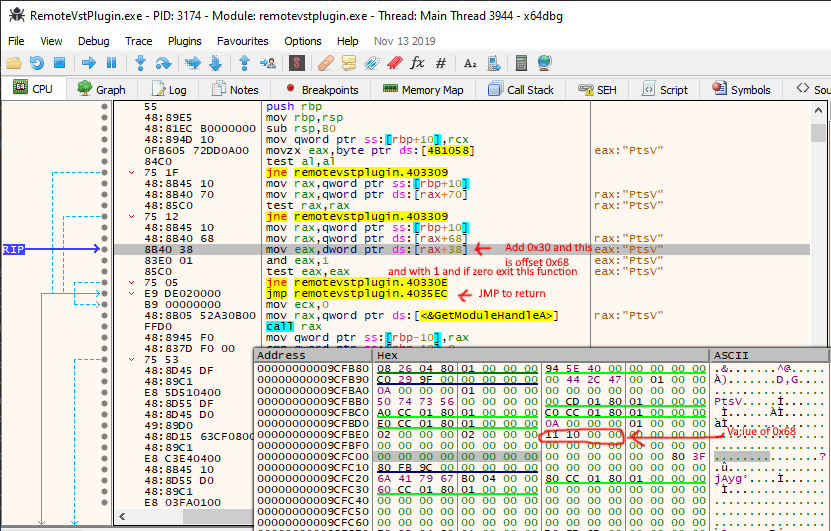

### Finally!

So while trying to figure out that sizes in the gap, I finally found a plugin (*DynamicAudioNormalizer*) that sets an other value in that range. I guess that is the advantage with a widely used interface a lot more corner cases will be used. The value at 0x80 appears to be a 4 byte value (0x000A6e1e), and is used both in 32 and 64 bit. What is more important though is the area I circled in blue stays the same between both 64 bit and 32 bit. This tells me that is only 2 values that probably are pointers in this gap. It also tells me that there are two more 4-byte before the float. It also means that area circled in pink on 64 bit is padding, and not a value.


### The Reaming Bytes

So when you have a 64 bit plugin the struct is 192 bytes long. I have been able to figure out layout of a 136 bytes. This leaves 56 bytes that I can't seem to find used by anything. When it comes to 32 bit plugins they are 144 bytes long, I have figured out 88 bytes. This also leaves 56 bytes. So it seems to be a safe bet these trailing bytes do not change in size.

## The Final Struct layout

Thus we have the finally enough information to make a preliminary struct layout. This probably is the layout unless shorts or bytes are used in which case there may be more padding. However, so far I have only seen dword and qword load and stores. The only exception so far is `val32_one` when LMMS is sprintf-ing it. Next I need to identify what each field does, and arguments and expected behavior of all function pointers we have discovered thus far.

```C
#include <stdint.h>

// Our preliminary Struct layout

struct vst_return_struct {
    uint8_t check_bytes[4];
    void* func0;
    void* func1;
    void* func2;
    void* func3;
    uint32_t val_0;
    uint32_t val_1;
    uint32_t val_2;
    uint32_t val_3;
    uint32_t val_5;
    void* something_0; // Could also be size_t or uintptr_t
    void* something_1; // Could also be size_t or uintptr_t
    uint32_t val_6;
    uint32_t val_7;
    uint32_t val_8;
    float float_0;
    void* struct_0;
    void* something_2; // Could also be size_t or uintptr_t
    uint32_t val_9;
    uint32_t val_A;
    void* func4;
    void* func5;
    uint8_t unknown[56];
};
```